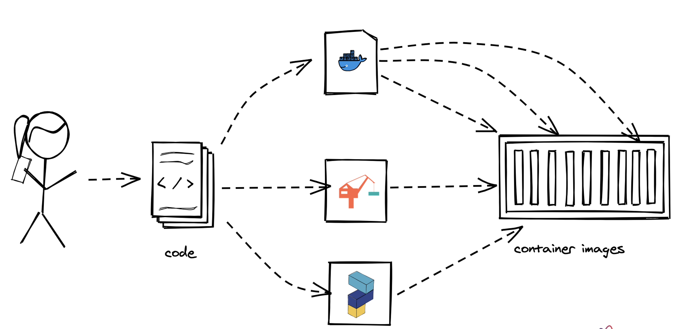
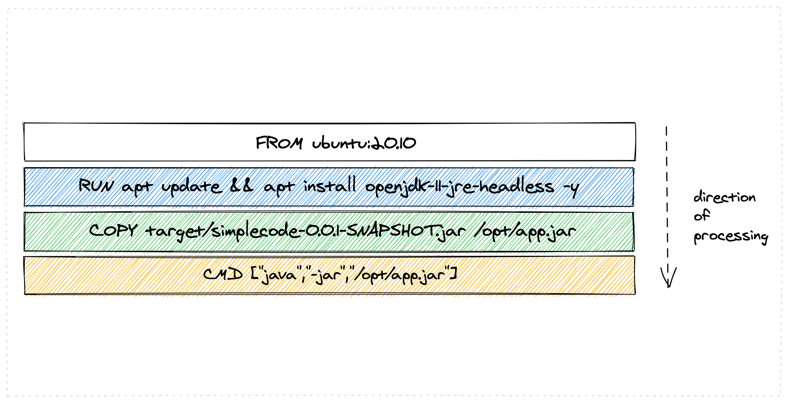
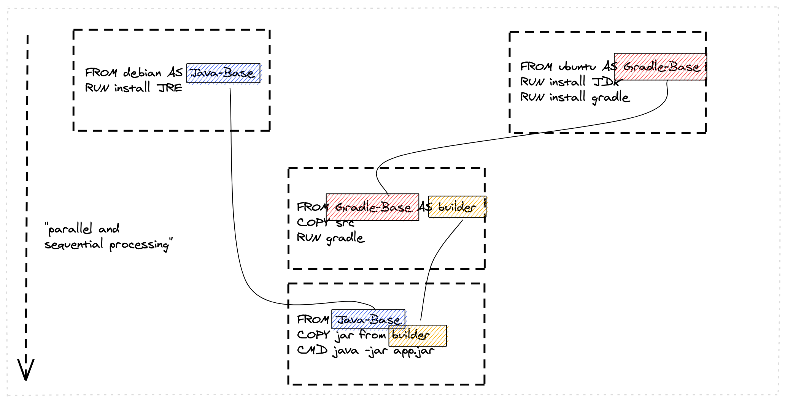
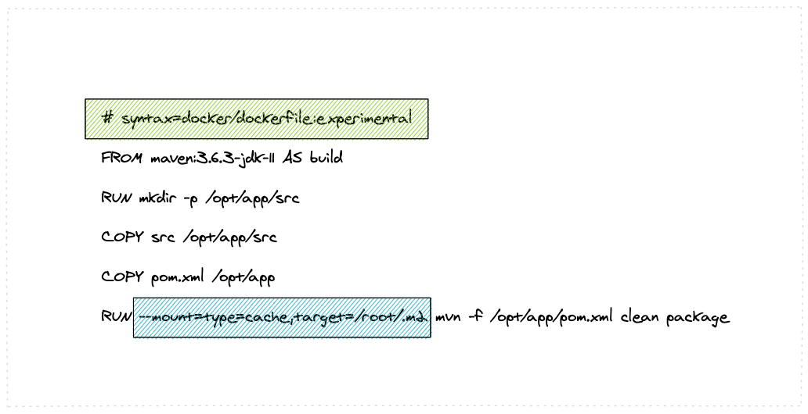
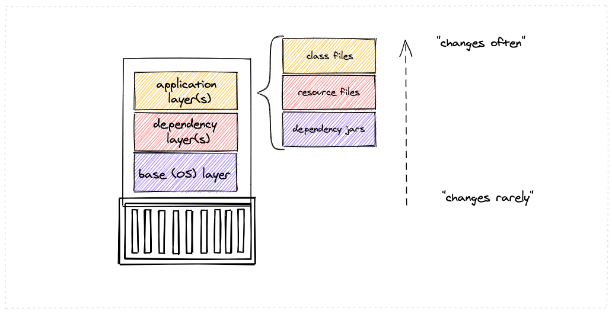
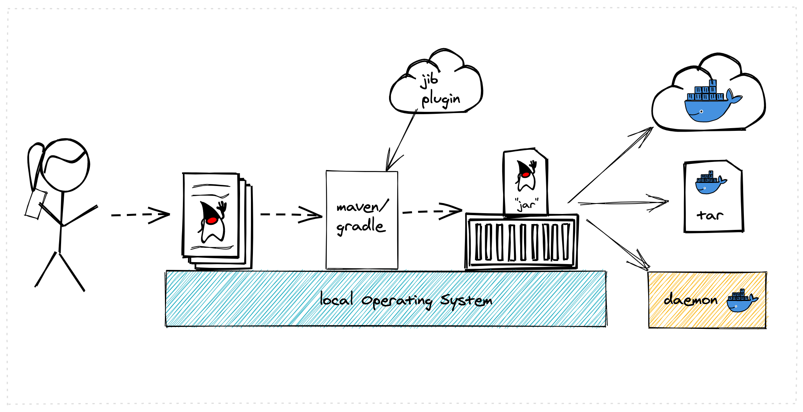
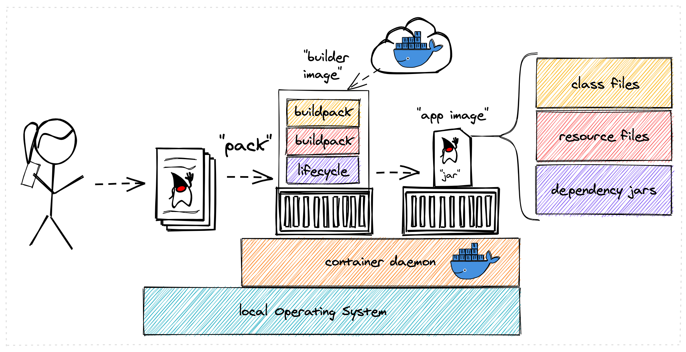
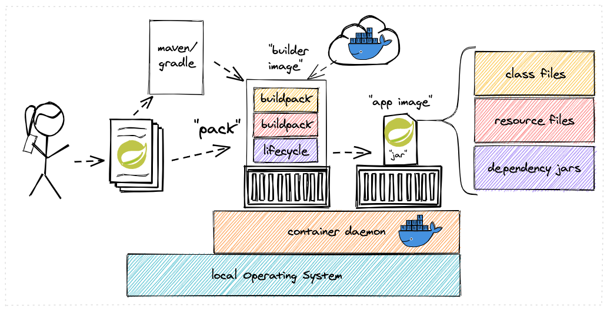

= Lab/Walkthrough instructions - Container Builds
:sectnums:

:toc:

This lab will walk you through steps to build container images with various technologies.

(C) Matthias Haeussler. Free for private purposes. (Re)distribution for commercial purposes not allowed without owner permissions.

== Prereqs

Mandatory:

* A Docker environment and Docker CLI https://docs.docker.com/get-docker/
* Pack CLI for Cloud-Native Buildpacks https://buildpacks.io/docs/tools/pack/
* Clone/Download this repo: https://github.com/options-galore-container-build

Recommended:

* A Java (11 or later) Development Kit for Java examples, e.g https://adoptopenjdk.net/

Optional:

* Dive tool https://github.com/wagoodman/dive

=== Validation

Validate docker installation.

[source]
----
docker version
----

Should display output like (version might differ):

----
Client:
 Cloud integration: 1.0.17
 Version:           20.10.8
 API version:       1.41
...

Server: Docker Engine - Community
 Engine:
  Version:          20.10.8
  API version:      1.41 (minimum version 1.12)
----

Validate Java.

[source]
----
java --version
----

Should display output like (version might differ):

----
openjdk 11.0.10 2021-01-19
OpenJDK Runtime Environment AdoptOpenJDK (build 11.0.10+9)
OpenJDK 64-Bit Server VM AdoptOpenJDK (build 11.0.10+9, mixed mode)
----

== Dockerfile Exercises

=== Set environment and build code

Download/clone the repo and change to the root folder: 
[source, bash]
----
git clone https://github.com/options-galore-container-build.git
----

Note: Without git CLI you can download the repo as zip file here: https://github.com/options-galore-container-build/archive/refs/heads/main.zip
Extract it and change your command line shell to the root folder.

[source, bash]
----
cd options-galore-container-build
----

Set to classic Docker mode:

[source, bash]
----
export DOCKER_BUILDKIT=0
----

Build the code:

Change to the Java sample app 
[source, bash]
----
cd java
----

Option 1 (with local JDK installed)
[source]
----
./mvnw clean package
----

Option 2 (with local JDK installed - using docker)
[source]
----
docker run -it --rm --name my-maven-project -v "$(pwd)":/opt/app -w /opt/app maven:3.6.3-jdk-11 mvn clean install
----

Validate build artefact (timestamps will of course be different)
[source]
----
ls -ltr ./target/simplecode-0.0.1-SNAPSHOT.jar
----
----
-rw-r--r--  1 mhs  staff  18985578 Nov 26 10:24 ./target/simplecode-0.0.1-SNAPSHOT.jar
----

=== Classic Dockerfile

Observe contents of Dockerfile-simple-ubuntu

[source]
----
cat Dockerfile-simple-ubuntu
----

----
FROM ubuntu:20.10
RUN apt update && apt install openjdk-11-jre-headless -y
COPY target/simplecode-0.0.1-SNAPSHOT.jar /opt/app.jar
CMD ["java","-jar","/opt/app.jar"]
----

Build first image with this Dockerfile:

[source]
----
docker build -f Dockerfile-simple-ubuntu -t java-app:v-simple-ubuntu .
----

Build images with other predefined base images:

[source]
----
docker build -f Dockerfile-simple-adoptopenjdk -t java-app:v-simple-adoptopenjdk .
----

[source]
----
docker build -f Dockerfile-simple-openjdk -t java-app:v-simple-openjdk .
----

Validate images in local repo

[source]
----
docker images
----

----
REPOSITORY     TAG                     IMAGE ID       CREATED              SIZE
java-app       v-simple-openjdk        7209f28736c8   53 seconds ago       247MB
java-app       v-simple-adoptopenjdk   0859e7278963   About a minute ago   263MB
java-app       v-simple-ubuntu         aed75c42f5d4   2 minutes ago        385MB
openjdk        11-jre-slim             8bbc180a8a27   10 days ago          228MB
adoptopenjdk   11-jre-hotspot          2c57fb3bc67b   8 weeks ago          244MB
maven          3.6.3-jdk-11            e23b595c92ad   8 months ago         658MB
----

Observe build history and differences of the 3 images

[source]
----
docker history java-app:v-simple-ubuntu
docker history java-app:v-simple-adoptopenjdk
docker history java-app:v-simple-openjdk
----

You will observe different base layers and structure, but always the same top layer: 
----
IMAGE          CREATED         CREATED BY                                      SIZE      COMMENT
7209f28736c8   3 minutes ago   /bin/sh -c #(nop)  CMD ["java" "-jar" "/opt/…   0B
e5385e2e3146   3 minutes ago   /bin/sh -c #(nop) COPY file:90a1db2252f31169…   19MB
----

Optional: Use tool "dive" to show detailed history of image:

----
dive java-app:v-simple-ubuntu
dive java-app:v-simple-adoptopenjdk
dive java-app:v-simple-openjdk
----

Use ctrl+m || ctrl+u

=== Multi-Stage

Build image with Multistage Dockerfile:

[source]
----
docker build -f Dockerfile-multistage-builder -t java-app:v-multistage-builder .
----

This will take a while as all the maven dependencies need to be downloaded.

Validate history:

[source]
----
docker history java-app:v-multistage-builder
----

Explore docker images: 

[source]
----
docker images
----

The image with the tag <none> is the result of the first stage in the Dockerfile ("build").

----
REPOSITORY     TAG                     IMAGE ID       CREATED          SIZE
java-app       v-multistage-builder    ca155ffc6d2a   5 minutes ago    263MB
<none>         <none>                  0498c7371461   5 minutes ago    739MB
----

=== BuildKit

Change to new Docker mode:

[source]
----
export DOCKER_BUILDKIT=1
----

Observe changed output: 

[source]
----
docker build -f Dockerfile-simple-adoptopenjdk -t java-app:v-simple-adoptopenjdk .
----

Obtain an alternative output: 

[source]
----
docker build --progress=plain -f Dockerfile-simple-adoptopenjdk -t java-app:v-simple-adoptopenjdk .
----

Build with multistage experimental cache: 

[source]
----
docker build -f Dockerfile-multistage-experimental-cache -t java-app:v-multistage-experimental-cache .
----

Change the code and rebuild: 

You can use an editor to change a method name in
src/main/java/de/maeddes/simplecode/SimplecodeApplication.java
or simply execute

[source]
----
sed -i .bak 's/hello/helloABC/g' src/main/java/de/maeddes/simplecode/SimplecodeApplication.java
----

Rebuild and observe faster build through caching: 

[source]
----
docker build -f Dockerfile-multistage-experimental-cache -t java-app:v-multistage-experimental-cache .
----

Observe the history to validate that top layer is still 'monolithic': 

[source]
----
docker history java-app:v-multistage-experimental-cache
----

Build the code with a layered jar approach: 

[source]
----
docker build -f Dockerfile-multistage-layered -t java-app:layered .
----

Display layered state

[source]
----
docker history java-app:layered
----

----
IMAGE          CREATED         CREATED BY                                      SIZE      COMMENT
de2cb7c4be82   8 seconds ago   ENTRYPOINT ["java" "org.springframework.boot…   0B        buildkit.dockerfile.v0
<missing>      8 seconds ago   COPY application/application/ ./ # buildkit     6.12kB    buildkit.dockerfile.v0
<missing>      8 seconds ago   COPY application/snapshot-dependencies/ ./ #…   0B        buildkit.dockerfile.v0
<missing>      8 seconds ago   COPY application/spring-boot-loader/ ./ # bu…   245kB     buildkit.dockerfile.v0
<missing>      8 seconds ago   COPY application/dependencies/ ./ # buildkit    18.9MB    buildkit.dockerfile.v0
----

== Jib

Again the use of the local maven wrapper (mvnw) will require a local JDK installation.
If it's not present use option 2.

Option 1: 
[source]
----
mvn compile com.google.cloud.tools:jib-maven-plugin:3.1.4:dockerBuild -Dimage=java-app:jib
----

Option 2: 
[source]
----
docker run -it --rm --name my-maven-project -v "$(pwd)":/opt/app -w /opt/app maven:3.6.3-jdk-11 mvn compile com.google.cloud.tools:jib-maven-plugin:3.1.4:buildTar -Dimage=java-app:jib
----
[source]
----
docker load -i target/jib-image.tar
----

[source]
----
docker history java-app:jib
----

----
IMAGE          CREATED        CREATED BY                                      SIZE      COMMENT
bafe5ced0d6f   51 years ago   jib-maven-plugin:3.1.4                          82B       jvm arg files
<missing>      51 years ago   jib-maven-plugin:3.1.4                          2.37kB    classes
<missing>      51 years ago   jib-maven-plugin:3.1.4                          1B        resources
<missing>      51 years ago   jib-maven-plugin:3.1.4                          18.9MB    dependencies
----

== Cloud-native buildpacks

[source]
----
pack builder suggest
----

[source]
----
pack config default-builder paketobuildpacks/builder:base 
----

[source]
----
pack build java-app:pack
----

== Paketo with Spring Boot and Maven

[source]
----
./mvn spring-boot:build-image -Dspring-boot.build-image.imageName=java-app:paketo
----

